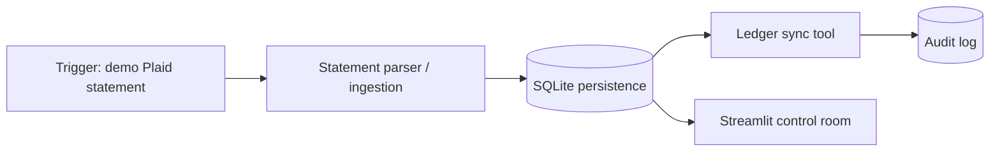

# Reconcile

Reconcile is an agentic bookkeeping prototype for Tech Zephyr 4.0. This repository currently delivers **Phase 1: skeleton and data flow**: a Plaid-shaped demo trigger persists bank transactions, syncs them to a local ledger adapter, and records the full handoff in an audit log.

## Run locally

```powershell
python -m venv .venv
.\.venv\Scripts\Activate.ps1
pip install -r requirements.txt
uvicorn app.main:app --reload
```

In another terminal:

```powershell
streamlit run streamlit_app.py
```

Open `http://localhost:8501`, click **Run Plaid sandbox demo**, and inspect the bank intake, ledger sync, and audit trail. The API docs are at `http://localhost:8000/docs`.

## Docker

```powershell
Copy-Item .env.example .env
docker compose up --build
```

The Phase 1 demo is self-contained and uses SQLite plus a local ledger adapter, so judges can run it without paid credentials. `.env.example` reserves the sandbox settings for the Plaid, QuickBooks, and Claude adapters planned for later phases.

## Architecture direction



The first implementation keeps each boundary separately callable: `app/services/ingestion.py` owns source intake, `app/services/ledger.py` owns ledger writes, `app/db.py` owns durable state, and `app/main.py` owns the API surface. Phase 2 will add the explicit LangGraph orchestrator, Claude structured categorization, confidence evaluation, and the human review queue without collapsing these modules.

## Requirements mapping

- Goal-driven execution: Phase 1 run endpoint executes intake, persistence, ledger sync, and audit logging as one run.
- Dynamic action selection: scheduled for Phase 2 with the explicit LangGraph graph.
- Multi-step execution: visible now across ingestion, SQLite, ledger sync, and audit logging.
- Adaptation: scheduled for Phase 3 with durable vendor memory and human corrections.
- Robustness: duplicate ingestion is handled now; malformed files and external API retry routing are scheduled for Phase 4.

## Tests

```powershell
pytest -q
```
